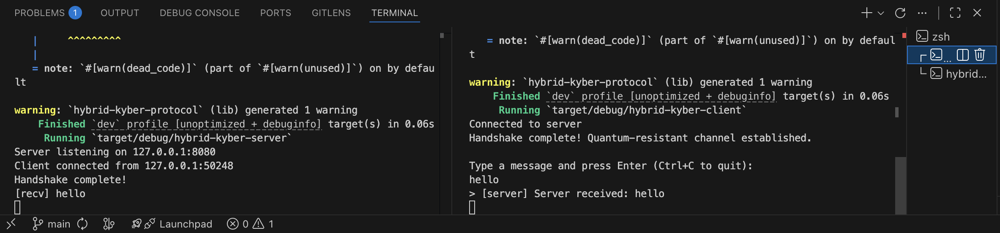

# Hybrid Post-Quantum Communication Channel

A TCP communication channel secured by a hybrid key exchange combining **CRYSTALS-Kyber768** (ML-KEM) and **X25519**, with **ChaCha20-Poly1305** AEAD for symmetric encryption.

Kyber768 provides IND-CCA2 security against quantum adversaries under the Module-LWE hardness assumption. X25519 provides classical ECDH security. The hybrid construction ensures that the channel remains secure as long as *either* primitive is unbroken — hedging against both a premature migration to post-quantum-only schemes and a practical quantum computer breaking elliptic curves.



## Cryptographic Design

### Key Exchange (Handshake)

```
  ┌──────────────────┐                                  ┌──────────────────┐
  │      Client      │                                  │      Server      │
  └────────┬─────────┘                                  └────────┬─────────┘
           │                                                     │
           │  Generate:                                          │
           │  ├─ (kyber_pk, kyber_sk) ← Kyber768.KeyGen()        │
           │  └─ (x25519_pk, x25519_sk) ← X25519.KeyGen()       │
           │                                                     │
           │              ┌─────────────────────┐                │
           │              │     ClientHello      │                │
           │              ├─────────────────────┤                │
           │              │ version: u8          │                │
           │              │ kyber_pk:  1184 B    │                │
           │              │ x25519_pk:   32 B    │                │
           │              └─────────────────────┘                │
           │ ──────────────────────────────────────────────────► │
           │                                                     │
           │                          Encapsulate(kyber_pk)      │
           │                            └─► (kyber_ct, ss_pq)    │
           │                          DH(x25519_sk, x25519_pk)   │
           │                            └─► ss_classical         │
           │                                                     │
           │              ┌─────────────────────┐                │
           │              │     ServerHello      │                │
           │              ├─────────────────────┤                │
           │              │ kyber_ct:  1088 B    │                │
           │              │ x25519_pk:   32 B    │                │
           │              └─────────────────────┘                │
           │ ◄────────────────────────────────────────────────── │
           │                                                     │
           │  Decapsulate(kyber_ct, kyber_sk)                     │
           │    └─► ss_pq                                        │
           │  DH(x25519_sk, x25519_pk)                           │
           │    └─► ss_classical                                 │
           │                                                     │
  ═════════╪═════════════════════════════════════════════════════╪══════════
           │            Both sides derive keys:                  │
           │                                                     │
           │   transcript = SHA-256(ClientHello ‖ ServerHello)   │
           │   IKM = ss_pq ‖ ss_classical                       │
           │                                                     │
           │   HKDF-SHA256(salt=transcript, ikm=IKM,            │
           │               info="hybrid-pq-channel-v1")         │
           │     ├─► k_c2s         (32 B)  client→server key    │
           │     ├─► k_s2c         (32 B)  server→client key    │
           │     ├─► nonce_base_c2s (12 B)                      │
           │     └─► nonce_base_s2c (12 B)                      │
           │                                                     │
  ═════════╪═════════════════════════════════════════════════════╪══════════
           │                                                     │
           │              ┌─────────────────────┐                │
           │              │  AppData (repeated)  │                │
           │              ├─────────────────────┤                │
           │              │ seq: u64             │                │
           │              │ ciphertext: Vec<u8>  │                │
           │              └─────────────────────┘                │
           │ ◄────────────────────────────────────────────────── │
           │ ──────────────────────────────────────────────────► │
           │          ChaCha20-Poly1305 AEAD                     │
           │          AAD = seq ‖ transcript                     │
           ▼                                                     ▼
```

### Why Hybrid?

A pure Kyber deployment bets entirely on the hardness of Module-LWE. Lattice-based schemes are young relative to ECDH; a hybrid approach means:

- If a cryptanalytic breakthrough reduces Kyber's security, X25519 still protects the session.
- If a cryptographically relevant quantum computer is built, Kyber still protects the session while X25519 falls.
- NIST SP 800-227 (2025) explicitly recommends hybrid constructions during the transition period.

The shared secrets are concatenated before HKDF extraction (`IKM = ss_pq ‖ ss_classical`), following the "concatenate-then-KDF" combiner pattern.

### Symmetric Encryption

Each direction has independent key material derived from HKDF:

| Parameter | Client → Server | Server → Client |
|---|---|---|
| Key (256-bit) | `k_c2s` | `k_s2c` |
| Nonce base (96-bit) | `nonce_base_c2s` | `nonce_base_s2c` |

Per-message nonces are constructed by XORing the nonce base with the sequence number:

```
nonce[0..4]  = nonce_base[0..4]
nonce[4..12] = nonce_base[4..12] XOR seq.to_be_bytes()
```

Additional authenticated data (AAD) for each message: `seq (8B) ‖ transcript (32B)`.

This binds every ciphertext to its position in the stream and to the specific handshake that established the session — preventing replay, reordering, and cross-session splicing.

### Wire Protocol

Length-prefixed framing over TCP:

```
┌─────────────────┬─────────────────────────┐
│  length: u32    │  payload: [u8; length]  │
│  (4 bytes, BE)  │                         │
└─────────────────┴─────────────────────────┘
```

Max frame size: 1 MB.

## Project Structure

```
crates/
├── crypto/          Cryptographic primitives
│   ├── kyber.rs       Kyber768 KEM (pqcrypto-kyber)
│   ├── x25519.rs      X25519 KEM wrapper (x25519-dalek)
│   ├── hkdf.rs        HKDF-SHA256 session key derivation
│   ├── aead.rs        ChaCha20-Poly1305 encrypt/decrypt
│   └── traits.rs      KEM / DH trait definitions
├── protocol/        Protocol logic
│   ├── messages.rs    ClientHello, ServerHello, AppData (serde + postcard)
│   ├── handshake.rs   Key exchange state machine
│   ├── transcript.rs  SHA-256 handshake transcript
│   ├── session.rs     SecureChannel (encrypt/decrypt with replay protection)
│   └── framing.rs     Async length-prefixed TCP framing
├── server/          TCP server binary
└── client/          TCP client binary
```

## Dependencies

| Crate | Purpose |
|---|---|
| `pqcrypto-kyber` | CRYSTALS-Kyber768 (ML-KEM-768) KEM |
| `x25519-dalek` | X25519 Diffie-Hellman |
| `chacha20poly1305` | ChaCha20-Poly1305 AEAD |
| `sha2` | SHA-256 for transcript hashing |
| `hkdf` | HKDF-SHA256 key derivation |
| `postcard` | Compact binary serialization |
| `tokio` | Async TCP runtime |

## Usage

```bash
# Build
cargo build

# Run server
cargo run --bin hybrid-kyber-server

# Run client (separate terminal)
cargo run --bin hybrid-kyber-client

# Run tests
cargo test
```

## Parameters

| Parameter | Value |
|---|---|
| KEM | CRYSTALS-Kyber768 (NIST security level 3, ~AES-192 equivalent) |
| ECDH | X25519 (Curve25519) |
| AEAD | ChaCha20-Poly1305 (256-bit key, 96-bit nonce) |
| KDF | HKDF-SHA256 |
| Transcript | SHA-256 |
| Key sizes | 32 bytes per direction |
| Nonce construction | XOR(base, sequence number) |
| Replay protection | Monotonic sequence counter |

## References

- [FIPS 203 — Module-Lattice-Based Key-Encapsulation Mechanism (ML-KEM)](https://csrc.nist.gov/pubs/fips/203/final)
- [NIST SP 800-227 — Recommendations for Key-Encapsulation Mechanisms](https://csrc.nist.gov/pubs/sp/800/227/final)
- [RFC 7748 — Elliptic Curves for Security (X25519)](https://www.rfc-editor.org/rfc/rfc7748)
- [RFC 8439 — ChaCha20 and Poly1305](https://www.rfc-editor.org/rfc/rfc8439)
- [RFC 5869 — HKDF](https://www.rfc-editor.org/rfc/rfc5869)
